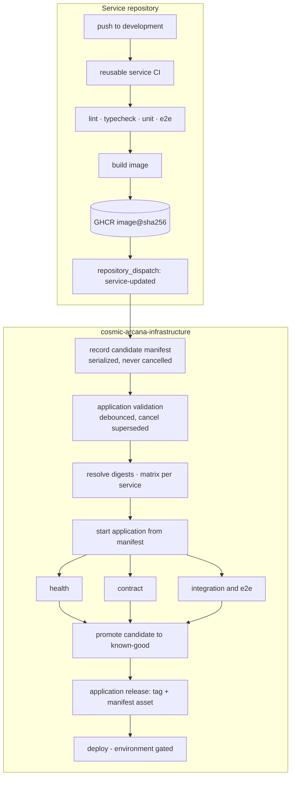
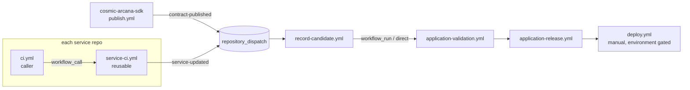
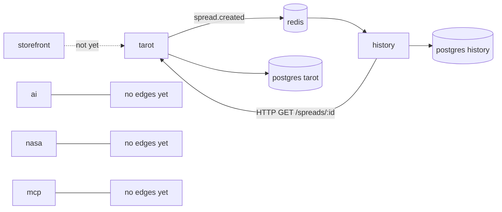

# CI/CD target architecture — Cosmic Arcana

Date: 2026-09-24
Companion to `docs/ci-cd-audit.md`. Everything here is derived from the audited system, not from a
generic template.

## 1. Current-state summary

Seven repositories, zero workflows, zero images, zero releases. One real synchronous edge
(`history → tarot`), one real asynchronous edge (`spread.created` over BullMQ), one shared contracts
package consumed through a `file:` path link that cannot survive a single-repository checkout. Unit
tests are fast and green; the two end-to-end suites are meaningful and Docker-bound; the storefront
does not build; `nasa-service-api` has no domain code; `mcp-service-api` serves mocks.

The design below therefore has two jobs: build the CI/CD system the project will need, and stay
honest about the fact that only part of the application currently has anything to validate.

## 2. Target architecture



Principle: **service CI produces immutable artifacts; the infrastructure repository owns application
state.** No service repository knows which versions of other services exist.

## 3. Workflow graph



Reusable workflows live in `cosmic-arcana-infrastructure/.github/workflows/`. All repositories are
public and in one organization, so `workflow_call` across repositories works without extra settings.

## 4. Application dependency graph used by validation



Validation tiers, derived strictly from what exists:

| Tier | Services | What runs |
| --- | --- | --- |
| Tier 1 — flow | tarot, history, postgres ×2, redis | health, contract, integration/e2e, smoke |
| Tier 2 — liveness | ai, nasa, mcp | container starts, `/health/live` and `/health/ready` answer |
| Excluded | storefront | build is broken; joins when fixed |

## 5. Release manifest design

Home: `cosmic-arcana-infrastructure/manifests/`.

```yaml
# manifests/development.yml  (known-good)
version: 1
channel: development
generatedAt: '2026-09-24T09:12:03Z'
validatedBy: 'https://github.com/Cosmic-Arcana/cosmic-arcana-infrastructure/actions/runs/123'
services:
  tarot-service-api:
    image: ghcr.io/cosmic-arcana/tarot-service-api@sha256:...
    commit: 7f3c2ab...
    repository: Cosmic-Arcana/tarot-service-api
    tier: flow
  history-service-api:
    image: ghcr.io/cosmic-arcana/history-service-api@sha256:...
    commit: 91ab44e...
    repository: Cosmic-Arcana/history-service-api
    tier: flow
  ai-service-api:
    image: ghcr.io/cosmic-arcana/ai-service-api@sha256:...
    commit: 2cd91f0...
    repository: Cosmic-Arcana/ai-service-api
    tier: liveness
contracts:
  '@cosmic-arcana/sdk': 0.1.0
```

- **Who creates it:** the infrastructure repository, never a service.
- **Who updates it:** `record-candidate.yml`, which rewrites exactly one service entry from a
  `repository_dispatch` payload and commits it to `manifests/development.candidate.yml`.
- **How the changed service is selected:** it is named in the dispatch payload by the service CI that
  just published the image.
- **How unchanged services are selected:** they are copied verbatim from the current candidate, whose
  ancestor is the last known-good manifest. Unchanged services are never rebuilt — their digest is
  reused, which is safe because a digest is immutable.
- **How compatibility is represented:** the `contracts` block pins the SDK version the validated set
  agreed on; a validated manifest is the statement "these digests plus this contract version work
  together".
- **How it reaches the tests:** as a committed file *and* as a workflow artifact; the compose file
  reads digests from generated `.env` values, so nothing is resolved by tag at runtime.
- **How it becomes a release:** on green validation the candidate is copied to `development.yml` and
  published as a GitHub Release (`app-<UTC timestamp>-<short sha>`) with the manifest attached as an
  immutable asset.
- **Rollback:** `deploy.yml` accepts a release tag, downloads that manifest, and deploys it. Rollback
  is therefore "deploy an older manifest", not "rebuild an older commit".

## 6. Service CI design

One reusable workflow, `service-ci.yml`, called by a five-line caller in each repository.

```text
caller (repo)                        reusable (infrastructure)
push development/main   ───────────▶ setup: node + npm cache
pull_request                         lint
                                     build (tsc/nest build)
                                     unit tests
                                     e2e tests          (opt-in, needs docker)
                                     ─ push events only ─
                                     docker build + push by digest (GHCR)
                                     repository_dispatch → infrastructure
```

Inputs: `service-name`, `tier`, `node-version` (default 22), `ref`, `lint-command`,
`build-command`, `test-command`, `e2e-command`, `build-image`, `dispatch`.
Outputs: `image-digest`, `image-ref`.

Why `workflow_call` rather than copies: six repositories share one shape (NestJS 11, npm, jest,
eslint, `nest build`). A change to the pipeline must not require six pull requests. The two
non-conforming repositories (`cosmic-arcana-sdk`, `cosmic-arcana-storefront`) pass different inputs
rather than forking the workflow.

Known adjustments required by the audit:

- `tarot-service-api` and `history-service-api` have no `*.spec.ts` under `src`, so their unit step
  calls `npm run test:e2e` and `run-unit-tests` is false. Alternative — fix their jest config — is
  listed as a follow-up so this plan does not silently change service behaviour.
- The SDK path dependency is replaced by a published package (§12); until that lands, those two
  repositories build their image with the SDK vendored through a build stage.

## 7. Application validation design

`application-validation.yml` in the infrastructure repository.

```text
debounce (45 s, cheap)
   │
   ▼
resolve   ── matrix: service ──▶ verify each digest exists in GHCR, print it
   │
   ▼
start     ── docker compose up from the candidate manifest
   │
   ├── health      : /health/live + /health/ready for every service in the manifest
   ├── contract    : SDK parsers over the real payloads the running system produces
   └── integration : the end-to-end flow, executed against the running stack
   │
   ▼
promote   ── candidate ➜ known-good, release created
```

The three suites run as a matrix so a failure names the suite; the stack is started inside each
matrix job from the same manifest, which keeps jobs independent and reproducible.

**Contract suite (uses only what exists).** It starts the stack, creates a spread, then:

1. reads the outbox row tarot wrote and runs `parseSpreadCreatedEnvelope` from the SDK version pinned
   in the manifest — the producer's bytes checked against the consumer's parser;
2. calls `GET /spreads/:id` and runs `parseSpreadDetailsV1`;
3. calls `GET /users/:id/spread-history` and checks the page shape.

No new test framework, no invented fixtures: the contracts and their parsers already exist.

**Integration suite.** The flow verified by hand during the audit, scripted: create a spread, wait
for the projection, assert the history row matches, replay the idempotency key and assert `200` with
`idempotency-replayed: true`, assert an unknown spread is `404`.

**Health suite.** Every service in the manifest, including tier-2 services that have nothing but a
health endpoint. This is what makes "the whole application still starts" a real statement.

## 8. Matrix strategy

| Where | Matrix over | Why it is genuine parallelism |
| --- | --- | --- |
| `resolve` | services in the manifest | independent registry lookups, per-service failure reporting |
| validation | `health`, `contract`, `integration` | independent stacks, independent failures |
| service CI | none | one repository builds one image; a matrix would be theatre |

Matrix is never used where `needs` is meant: `resolve → validate → promote` is a dependency chain.

## 9. `needs` strategy

```text
debounce ──▶ resolve ──▶ validate (matrix) ──▶ promote ──▶ release
                 │                                  ▲
                 └────────── manifest artifact ─────┘
```

`promote` runs only if every matrix leg succeeded; `release` only if `promote` committed. Nothing
else is serialized.

## 10. Caching strategy

| Cache | Key | Invalidated by |
| --- | --- | --- |
| npm | `setup-node` cache, hash of `package-lock.json` | any dependency change |
| Docker layers | `type=gha`, scope per service | Dockerfile, sources, base image digest |
| Base images | pinned by tag in the Dockerfile, digest recorded in the image | explicit bump |
| Unchanged service images | **not a cache — a manifest reference by digest** | never stale by construction |

Invalidation rules for "reuse the existing image of an unchanged service": a service is rebuilt when
its repository receives a push, which covers source, dependencies, Dockerfile, build config and
workflow changes, since all of those live in that repository. Two cases cross repository boundaries
and are handled explicitly:

1. **Contract change.** The SDK publish workflow dispatches `contract-published`. Validation then
   runs with the new contract version against the existing service digests, so an incompatible
   contract fails before any service adopts it.
2. **Base image change.** A weekly scheduled rebuild (`schedule` on each service caller) refreshes
   images so a base-image CVE fix is not stuck behind "nobody pushed".

Caching never decides correctness: the manifest decides what runs, and every entry is a digest.

## 11. Artifact strategy

| Artifact | Produced by | Consumed by | Why not something else |
| --- | --- | --- | --- |
| candidate manifest | `record-candidate` | validation, promote | committed file is the source of truth; the artifact makes a failed run inspectable |
| image digest | service CI job output | dispatch payload | an output, not an artifact — it is one line |
| compose + service logs | validation | humans debugging a failure | uploaded only on failure |
| test reports | validation suites | humans | always uploaded, per suite |

Nothing is passed through an artifact that can be passed as a job output or a committed file.

## 12. Contract strategy

> **Implemented differently, deliberately.** The git-dependency fallback described at the end of
> this section is what shipped: GitHub Packages needs a token even for a public package, which would
> put a `read:packages` PAT on every developer machine and a BuildKit secret in every image build.
> `docs/ci-cd-implementation.md` §8 records the decision and how to switch if the trade flips.

Move `@cosmic-arcana/sdk` from a path link to a published package on **GitHub Packages**:

```text
sdk push to main
   │
   ▼
build + unit tests
   │
   ▼
npm publish  (version from package.json, immutable)
   │
   ├── repository_dispatch: contract-published → infrastructure
   └── consumers pin "@cosmic-arcana/sdk": "0.1.x"
```

- Publishing is immutable: republishing a version is refused by the registry, so a manifest that
  pins `0.1.0` always means the same bytes.
- Consumers authenticate with `GITHUB_TOKEN` and `packages: read` in CI; local development uses a
  personal token in `~/.npmrc`. This friction is the price of immutability; the alternative
  (`github:Cosmic-Arcana/cosmic-arcana-sdk#v0.1.0` git dependency, no auth) is documented as the
  fallback if the friction outweighs the benefit.
- A contract change validates the *existing* application against the *new* contract before any
  service adopts it, which is the compatibility check this system actually needs. Consumer bumps stay
  ordinary pull requests (Dependabot is a follow-up, not part of this plan).

## 13. Commit coalescing and deduplication

The requirement: ten commits in five minutes must not mean ten full-stack validations, and no change
may be silently skipped.

```text
dispatch A ─▶ record candidate (serialized, never cancelled) ─┐
dispatch B ─▶ record candidate (serialized, never cancelled) ─┼─▶ candidate manifest = newest of all
dispatch C ─▶ record candidate (serialized, never cancelled) ─┘
                                                              │
                                              validation run  ▼  (cancel-in-progress)
                                        A started → cancelled by B → cancelled by C → C validates
```

Two stages, two semantics:

- **Recording is cheap and must never be lost.** `concurrency: manifest-candidate-<channel>`,
  `cancel-in-progress: false`. Each dispatch appends its own service digest to the candidate.
- **Validation is expensive and only the newest matters.** `concurrency:
  application-validation-<channel>`, `cancel-in-progress: true`, preceded by a 45 s debounce so a
  burst does not even start work that a newer dispatch would throw away.

Because the candidate always carries *every* recent change, cancelling a validation never loses a
service's change — the surviving run covers it. This is the property a naive "cancel-in-progress on
the dispatch" design gets wrong, and the reason for the two-stage split.

Rejected alternatives: hourly schedule (validates stale state, delays feedback), queueing every run
(cost grows linearly with commits), `merge_group` (no merge queue in use yet).

## 14. Concurrency strategy

| Workflow | Group | Cancel in progress | Reason |
| --- | --- | --- | --- |
| service CI (push) | `service-ci-<repo>-<ref>` | true | only the newest commit of a branch is interesting |
| service CI (pull request) | `service-ci-<repo>-pr-<number>` | true | same, per pull request |
| record candidate | `manifest-candidate-<channel>` | **false** | serialized writer, never lose a change |
| application validation | `application-validation-<channel>` | true | validate the newest state |
| promote/release | `application-release-<channel>` | **false** | a half-written release is worse than a slow one |
| deploy production | `application-production` | **false** | never cancel a deployment mid-flight |

Manifest writes additionally use fetch–rebase–retry so two record jobs cannot lose each other's
changes even if the concurrency group is bypassed by a manual run.

## 15. Release strategy

- **Identifier:** `app-<UTC yyyyMMdd-HHmm>-<short sha of the manifest commit>`. Not a service
  version, not semver — an application release is a *set*.
- **Contents:** the manifest (digests + commits + contract version), the validation run URL, and the
  test reports.
- **Immutability:** digests, plus a Git tag, plus the release asset. `latest` never appears in
  orchestration; a moving `development` image tag is published for humans only.
- **Promotion:** `deploy.yml` takes a release tag and an environment. The `production` GitHub
  Environment carries required reviewers, so promotion is a human decision with an audit trail.
- **Reality check:** no deployment target exists. `deploy.yml` ships as a gated stub that resolves
  and prints the manifest, so the release path is exercised without pretending infrastructure exists.

## 16. Security model

| Concern | Decision |
| --- | --- |
| Default permissions | `permissions: contents: read` at workflow level, everywhere |
| `packages: write` | only in the image-publishing job of service CI |
| `contents: write` | only in `record-candidate` and `promote` (manifest commits, release creation) |
| Fork pull requests | build and test only; no image push, no dispatch, no secrets. `pull_request_target` is not used |
| Cross-repository dispatch | fine-grained PAT scoped to the infrastructure repository only, stored as an organization secret. A GitHub App is the documented upgrade |
| Registry | GHCR with `GITHUB_TOKEN`; no external registry credentials |
| Cloud credentials | none exist; when they do, OIDC with an environment-scoped role, never long-lived keys |
| Branch protection | required status checks and no force-push on `main` and `development` in every repository, so a branch cannot rewrite a privileged workflow |
| Actions token approving reviews | disable `can_approve_pull_request_reviews` at organization level |
| Secrets for tests | `NASA_API_KEY` and `ANTHROPIC_API_KEY` only in jobs that need them, never in pull-request-triggered jobs |

## 17. Failure scenarios

| Scenario | Behaviour |
| --- | --- |
| Unit tests fail | service CI stops before building an image; no dispatch; manifest untouched |
| Image build fails | same; the previous digest stays the newest known for that service |
| Digest missing in GHCR at resolve time | resolve matrix fails naming the service; validation never starts |
| One validation suite fails | that matrix leg is red and names the suite; candidate is **not** promoted; logs and the candidate manifest are uploaded |
| Validation cancelled by a newer dispatch | no state changes; the newer run covers both changes |
| Two services dispatch simultaneously | record jobs serialize; the candidate ends up with both digests |
| Promote job interrupted | release tag is created last; an interrupted promote leaves the known-good manifest unchanged |
| Contract published that breaks a consumer | validation fails on the contract suite before any consumer upgrades |
| Flaky infrastructure | re-run the validation workflow; it is reproducible from the candidate manifest |

## 18. Rollback strategy

1. Every promoted manifest is a Git tag and a release asset.
2. `deploy.yml` accepts a release tag and deploys exactly those digests — no rebuild, no ambiguity.
3. To roll back a bad known-good state, re-run promote with the previous release tag; the candidate
   is rewritten from it, so the next service dispatch builds on the good baseline.
4. Because images are referenced by digest and GHCR retains them, rollback never depends on a
   service repository's Git history.

## 19. Migration steps

1. Create `cosmic-arcana-infrastructure` with the reusable workflows, manifests, compose file and
   validation scripts.
2. Publish `@cosmic-arcana/sdk` `0.1.0` to GitHub Packages; switch tarot and history from the `file:`
   link to the published version.
3. Add a `Dockerfile` to each service that has something to run.
4. Add the caller workflow to each repository, initially without `build-image`, to prove lint/test.
5. Turn on image publishing for the two tier-1 services, seed the first candidate manifest.
6. Enable application validation on dispatch; run it once manually with `workflow_dispatch`.
7. Add tier-2 services to the manifest as liveness-only entries.
8. Enable branch protection and required checks once the workflows are known-green.
9. Storefront joins after its build is fixed.

## 20. Files to create or modify

| Repository | File | Action |
| --- | --- | --- |
| `cosmic-arcana-infrastructure` (new) | `.github/workflows/service-ci.yml` | reusable service pipeline |
| | ~~`.github/workflows/sdk-ci.yml`~~ | not built: with one caller, the pipeline lives in the sdk repository itself |
| | `.github/workflows/record-candidate.yml` | dispatch receiver, serialized manifest writer |
| | `.github/workflows/application-validation.yml` | debounce, resolve, validate, promote |
| | `.github/workflows/deploy.yml` | environment-gated, manifest-driven stub |
| | `manifests/development.yml`, `development.candidate.yml` | application state |
| | `compose/application.yml`, `compose/.env.example` | the application, by digest |
| | `scripts/manifest.mjs`, `scripts/validate-*.mjs` | manifest tooling and the three suites |
| | `docs/*` | audit, plan, implementation report |
| every service repo | `.github/workflows/ci.yml` | caller |
| | `Dockerfile`, `.dockerignore` | image |
| `tarot`, `history` | `package.json` | SDK dependency by version |
| `cosmic-arcana-sdk` | `.github/workflows/ci.yml`, `package.json` publishConfig | publish |
| `cosmic-arcana-storefront` | `lib/auth0.ts` (or remove `proxy.ts`) | unblock the build |

## 21. Risks and trade-offs

| Risk | Mitigation / accepted cost |
| --- | --- |
| GitHub Packages needs auth even for public packages | accepted for immutability; git-dependency fallback documented |
| A fine-grained PAT is a long-lived credential | scoped to one repository, dispatch-only; GitHub App is the upgrade path |
| 45 s debounce delays the first feedback | only on the application stage; service CI feedback is immediate |
| Validation cancels mid-run | safe by construction (candidate holds every change); wasted minutes are the cost |
| Tier-2 services only get a liveness check | honest: they have no behaviour to test yet |
| Storefront excluded | it does not build; including it would make the pipeline permanently red |
| Compose-based validation is not production-like | the project has no production target yet; revisit when one exists |
| Weekly rebuilds cost minutes | small, and the alternative is images that silently rot |
